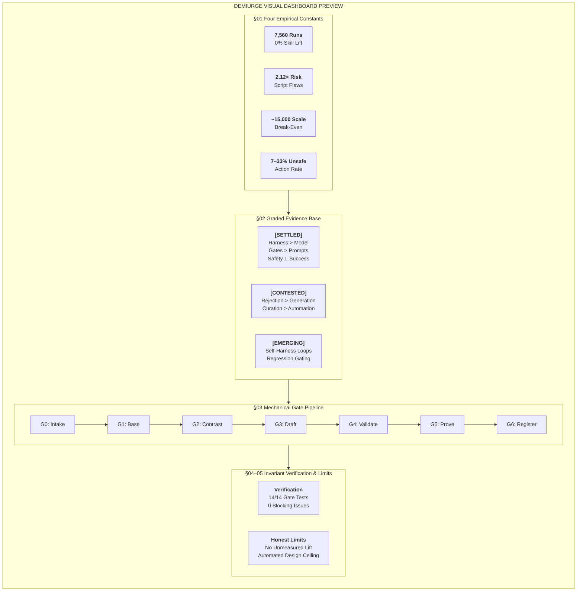

<div align="center">
  <h1>Demiurge</h1>
  <p><b>Two autonomous agents in an empirical feedback loop. One researches; one designs.</b></p>
</div>

<div align="center">
  
</div>

Demiurge isolates empirical research from agent synthesis. Self-contained, dependency-free, and anchored on deterministic quality gates.

| Agent | Responsibility | Core Principle |
|---|---|---|
| **Marcus** | Designs, scaffolds, audits, and proves agent skills. | Refuses to ship any agent without measured evidence. |
| **Buckminster** | Researches agentic engineering and standards. | Every claim requires 3 verified, hyperlinked sources. |

Named for Marcus Aurelius (wrote guidance, then followed it) and Buckminster Fuller (comprehensive anticipatory design science).

---

## Architecture

```
Buckminster ──proposes diff──> Operator Sign-Off ──merges──> research/RESEARCH.md
                                                                      │
                                                                   read by
                                                                      │
Agent Packages <──emits & proves── Marcus ──checks gates (G0-G6) <────┘
```

- **Strict One-Way Flow:** Buckminster researches; Marcus designs. Marcus ignores claims unlisted in `research/RESEARCH.md`.
- **Human Governance:** Knowledge base updates require explicit operator approval.
- **Tiered Deterministic Gates:** Invariants execute via automated operating system processes across three mechanical tiers: agent synthesis validation gates, repository-level pre-commit linters, and empirical benchmark regression harnesses.

---

## Documentation

| Guide | Scope & Focus |
|---|---|
| [Master Documentation](docs/DOCUMENTATION.md) | Top-Level Design (TLD), Low-Level Design (LLD), and full system specification. |
| [Installation Guide](docs/INSTALLATION.md) | Deployment across harnesses, offline execution model, and optional research connectors. |
| [Operating Guide](docs/OPERATING_GUIDE.md) | Operational workflows, prompt templates, 7 gotchas, and best practices. |
| [Design Manual](docs/AGENT_DESIGN.md) | Human companion guide: structural layers, decision trees, and checklists. |
| [Benchmarks Guide](docs/BENCHMARKS.md) | Independent evaluation (SWE-bench, GAIA, Tau-bench) and metrics engine. |
| [Research Methodology](skills/buckminster/references/RESEARCH_METHODOLOGY.md) | Tri-source verification protocols, search disciplines, and evidence grading. |
| [Empirical Knowledge Base](research/RESEARCH.md) | Canonical empirical research: benchmarks, failure modes, and primitives. |
| [Agent Architecture Spec](skills/marcus/AGENT_ARCHITECTURE.md) | Progressive disclosure specifications and mechanical gate enforcement (G0–G6). |

### Executive Research Brief

[Visual Dashboard](https://htmlpreview.github.io/?https://github.com/syst0m/demiurge/blob/main/skills/marcus/human-only/demiurge-brief.html)

<!-- BEGIN DEMIURGE BRIEF GIST -->


#### Four Empirical Constants That Shaped the Design

- **7,560**: runs in the only large controlled test of generated skills — which found no improvement over no skill at all
- **2.12×**: more likely to carry a vulnerability when a skill bundles executable scripts
- **~15,000**: deployed examples before automated design paid for itself — and only on two datasets of those tested
- **7–33%**: unsafe-action rate across fully scaffolded agents, uncorrelated with their task success

#### Core Architectural Takeaways

- **Rejection Outweighs Generation:** Methods that achieve real performance lift (e.g., SkillCAT +49.7%) succeed by ruthlessly discarding candidates through contrastive test replay, not through speculative prompt generation.
- **The Harness Dominates the Model:** Model×harness pairing varies completion and efficiency dramatically across execution trajectories—enough to invert raw model leaderboard rankings.
- **Capability and Safety Are Orthogonal:** Unsafe-action rates (7–33%) do not track task success rates (39–64%). Scaling capability without mechanical write-gates amplifies vulnerability.
- **Four-Tier Trust Model ($T_0$ to $T_3$):** Strict mechanical progression from untrusted intake to isolated baseline contrast before any skill or harness is accepted.
<!-- END DEMIURGE BRIEF GIST -->

---

## Evidence & Empirical Discipline

Architectural decisions anchor exclusively in verifiable empirical data:

- **Tri-Source Verification (Rule K-6):** Findings require three independent citations; peer-reviewed research prioritized; vendor citations capped at one.
- **Strict Grounding Gates (G0 & G3):** Marcus blocks skill synthesis absent validated entries in `research/RESEARCH.md`.
- **Confidence Taxonomy:**

| Marker | Standard | Architectural Action |
|---|---|---|
| `[SETTLED]` | Replicated empirical data or open standards. | Mandatory default architecture; deterministic gate policy. |
| `[CONTESTED]` | Conflicting data or single un-replicated study. | Configurable operator trade-off; requires explicit selection. |
| `[VENDOR]` | Produced by commercial vendor. | Opt-in requirement; flagged commercial interest. |
| `[EMERGING]` | Mechanistically sound; unverified in production. | Documented in research notes; excluded from gating. |

---

## Independent Benchmarking & Validation

Demiurge validates framework utility against bare foundation models. Architectural overhead requires positive resolution lift ($\Delta > 0$) and reduced unit cost. Detailed specifications and methodologies reside in [docs/BENCHMARKS.md](docs/BENCHMARKS.md).

### Benchmark Run Registry

| Run ID | Execution Mode | Model Backbone | Suite | Tasks | Bare Pass | Demiurge Pass | Delta ($\Delta$) | Cost / Fix (Bare vs Demiurge) | Report |
|---|---|---|---|---|---|---|---|---|---|
| `v0.2.0-swebench-001` | Simulated (Dry-Run) | `claude-3-5-sonnet-20241022` | SWE-bench Lite | 5 | 40.0% | **80.0%** | **+40.00%** | $0.2050 vs **$0.0533** (-74%) | [Summary](docs/reports/swebench_v020_summary.md) |
| `v0.3.0-swebench-full` | Simulated (Dry-Run) | `claude-3-5-sonnet-20241022` | Full SWE-bench | 2,294 | 39.97% | **60.03%** | **+20.06%** | $0.2069 vs **$0.0721** (-65%) | [Summary](docs/reports/swebench_full_2294_summary.md) |
| `v0.4.0-gemini-live` | Live API | `gemini-3.1-flash-lite-preview` | SWE-bench Live | 5 | 80.0%* | 20.0%* | Refusal / G0 | $0.0001 vs $0.0015 | [Summary](docs/reports/swebench_gemini_v040_summary.md) |
| `v0.5.0-cybergym-001` | Simulated (Dry-Run) | `gemini-3.0-flash` | CyberGym Subset | 5 | 0.00% | **0.00%** | **+0.00%** | $0.0004 vs **$0.0028** (4 vs 6 turns) | [Summary](eval_results/cybergym/report.md) |
| `v0.6.0-exploitbench-001` | Simulated (Dry-Run) | `gemini-3.0-flash` | ExploitBench Flagship | 5 | 0.00% | **0.00%** | **+0.00%** | $0.0004 vs **$0.0026** (4 vs 6 turns) | [Summary](eval_results/exploitbench/report.md) |
| `v0.7.0-swebench-live` | Live API | `gemini-3.1-flash-lite-preview` | SWE-bench Lite | 2 | 100.0% | **100.0%** | **+0.00%** | $0.0002 vs **$0.0005** (6 vs 4 turns) | [Summary](eval_results/swebench/report.md) |

*\*Note: On Gemini 3.1 Flash-Lite, the bare model complied by inventing fictional code, whereas Demiurge strictly enforced Gate G0, refusing to synthesize patches absent genuine repository context and local failure traces.*
