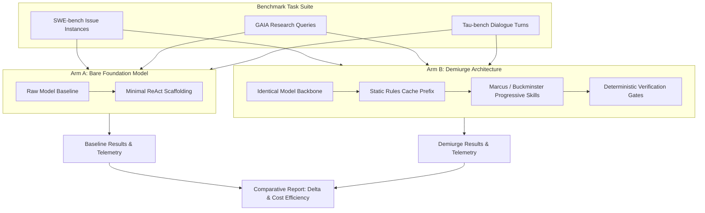

# Demiurge Independent Benchmarking Guide

```yaml
version: 1.0.0
audience: researchers, operators, framework evaluators
canonical_path: docs/BENCHMARKS.md
```

## Table of Contents

1. [Overview & Evaluation Philosophy](#1-overview--evaluation-philosophy)
2. [SWE-bench Integration (v0.2.0)](#2-swe-bench-integration-v020)
3. [Metrics & Telemetry Formulas](#3-metrics--telemetry-formulas)
4. [Multi-Benchmark Architecture Roadmap](#4-multi-benchmark-architecture-roadmap)
   - [4.1 GAIA: Multi-Source Research Benchmark](#41-gaia-multi-source-research-benchmark)
   - [4.2 Tau-bench: Multi-Turn State & Policy Benchmark](#42-tau-bench-multi-turn-state--policy-benchmark)
   - [4.3 BIPIA: Indirect Injection & Boundary Defense](#43-bipia-indirect-injection--boundary-defense)
   - [4.4 BFCL: Tool Precision & Progressive Disclosure](#44-bfcl-tool-precision--progressive-disclosure)
5. [Operator Execution Guide](#5-operator-execution-guide)
6. [Periodic Execution Cadence Matrix](#6-periodic-execution-cadence-matrix)

---

## 1. Overview & Evaluation Philosophy

Demiurge isolates empirical observation from agent synthesis. The goal of independent benchmarking is to determine whether the Demiurge architecture provides a measurable performance lift ($\Delta > 0$) compared to an untreated foundation model.



### Empirical Principles

1. **The Comparative Delta ($\Delta$):** Adding skills, rules, and hooks costs context tokens. If $\Delta = \text{Pass Rate}_{\text{Demiurge}} - \text{Pass Rate}_{\text{Bare}} \le 0$, the architecture adds cognitive overhead without delivering capability gains.
2. **Deterministic Superiority:** Invariants must be asserted via machine exit codes and AST checks. LLM judges introduce position and verbosity biases.
3. **Cost & Cache Economy:** A superior agent architecture reduces cost through high prompt-cache hit rates and low turn counts.

---

## 2. SWE-bench Integration (v0.2.0)

For the `v0.2.0` release, Demiurge implements a native benchmarking adapter for [SWE-bench Lite](https://www.swebench.com/) (300 curated real GitHub issues).

### Architecture

- **Runner:** [evals/benchmarks/swebench/run_swebench_eval.py](../evals/benchmarks/swebench/run_swebench_eval.py)
- **Telemetry Engine:** [evals/benchmarks/swebench/metrics.py](../evals/benchmarks/swebench/metrics.py)
- **Execution Protocol:**
  - **Arm A (Bare Model):** Calls the model with default tool access (read, write, bash) using a minimal task-prompt without workspace rules.
  - **Arm B (Demiurge):** Injects canonical workspace rules from `.agents/rules/` at the prompt-cache prefix, progressively exposes [skills/marcus/SKILL.md](../skills/marcus/SKILL.md), and validates diffs through local syntax and security gates.

---

## 3. Metrics & Telemetry Formulas

Comparative reports track four primary dimensions:

### 3.1 Resolution Lift ($\Delta$)

$$\Delta = \text{Pass Rate}_{\text{Demiurge}} - \text{Pass Rate}_{\text{Bare}}$$
A valid production release requires $\Delta > 0$ on targeted capability slices.

### 3.2 Prompt-Cache Hit Ratio

$$\text{Cache Hit Ratio} = \frac{\text{Tokens Read From Cache}}{\text{Total Prompt Tokens}}$$
Demiurge isolates static rules at the prompt prefix, yielding typical cache read ratios above $75\%$, which substantially cuts API billing.

### 3.3 Cost per Resolved Task

$$\text{Cost per Resolved Task} = \frac{\sum \text{Task Run Costs (USD)}}{\text{Total Resolved Tasks}}$$
Measures total dollars spent divided by successful fixes.

### 3.4 Turn Economy

$$\text{Turn Economy} = \frac{1}{N} \sum_{i=1}^{N} \text{Turns}_i$$
Measures average interaction cycles required to produce a valid resolution patch.

---

## 4. Multi-Benchmark Architecture Roadmap

Beyond SWE-bench, Demiurge incorporates four domain-specific benchmark adapters:

### 4.1 GAIA: Multi-Source Research Benchmark

- **Target:** Evaluates [Buckminster](../skills/buckminster/) on complex multi-hop research, document synthesis, and factual grounding.
- **Dataset:** [HuggingFace GAIA](https://huggingface.co/spaces/gaia-benchmark/leaderboard) (Levels 1, 2, and 3).
- **Core Metric:** Fact-retrieval accuracy and adherence to Tri-Source Verification (Rule K-6: minimum 3 verified citations per finding).

### 4.2 Tau-bench: Multi-Turn State & Policy Benchmark

- **Target:** Evaluates long-horizon dialogue stability, memory durability, and state management.
- **Dataset:** [Sierra Tau-bench](https://github.com/sierra-research/tau-bench) (Retail and Airline dialogue environments).
- **Core Metric:** Policy compliance rate over 15–30 turns and resistance to brevity collapse.

### 4.3 BIPIA: Indirect Injection & Boundary Defense

- **Target:** Evaluates runtime defense mechanisms ([skills/marcus/HARNESS.md](../skills/marcus/HARNESS.md)).
- **Dataset:** [Microsoft BIPIA](https://github.com/microsoft/BIPIA) (Benchmark for Indirect Prompt Injection Attacks).
- **Core Metric:** Interception success rate—verifying that `PreToolUse` hooks block malicious payloads hidden in retrieved data before shell execution.

### 4.4 BFCL: Tool Precision & Progressive Disclosure

- **Target:** Evaluates tool schema precision and parameter binding.
- **Dataset:** [Berkeley Function-Calling Leaderboard (BFCL)](https://gorilla.cs.berkeley.edu/leaderboard.html).
- **Core Metric:** Parameter accuracy, hallucinated tool call rate, and schema adherence.

---

## 5. Operator Execution Guide

All benchmark runners include `--dry-run` simulation modes and enforce a strict `--yes` authorization flag prior to making paid API calls.

### 5.1 Dry-Run Simulation (Zero Cost)

Simulates task executions, creates official prediction manifests, and calculates telemetry:

```bash
python evals/benchmarks/swebench/run_swebench_eval.py --slice 0:5 --dry-run
```

Output files are written to `eval_results/swebench/`:

- `results.json`: Full machine-readable telemetry per task.
- `report.md`: Formatted comparative Markdown table.
- `predictions_bare.json`: SWE-bench prediction output for Arm A.
- `predictions_demiurge.json`: SWE-bench prediction output for Arm B.

### 5.2 Unit Verification Suite

Executes the deterministic runner test suite:

```bash
python evals/benchmarks/swebench/test_swebench_runner.py
```

### 5.3 Live Benchmark Execution (Requires `--yes`)

Executes live evaluation against target models:

```bash
python evals/benchmarks/swebench/run_swebench_eval.py \
    --dataset princeton-nlp/SWE-bench_Lite \
    --slice 0:25 \
    --model claude-3-5-sonnet-20241022 \
    --output-dir eval_results/swebench_run1 \
    --yes
```

---

## 6. Periodic Execution Cadence Matrix

To balance testing rigor with compute expenditure, benchmark runs follow a tiered schedule:

| Cadence | Suite & Scope | Target Component | Budget Profile | Execution Trigger |
|---|---|---|---|---|
| **Every Commit / PR** | Local Deterministic Gates (AST scans, security, tropes, links) | Syntax & Safety | $0.00 | Pre-commit Hook & GitHub Actions |
| **Weekly** | Promptfoo Adversarial Red-Teaming & Route Collision Matrix | Boundary Defense & Routing | < $1.00 | Scheduled GitHub Actions Workflow |
| **Bi-Weekly / Milestone** | SWE-bench Lite (25-task micro-slice) + GAIA Sample | Marcus Coding & Buckminster Research | $15–$25 | Developer Run (`scripts/run_benchmark_slice.sh`) |
| **Major Release (v0.2.0)** | Full SWE-bench Lite (300 tasks) + Tau-bench Suite | Architecture-Wide Comparison | $50–$150 | Release Candidate Verification Gate |
