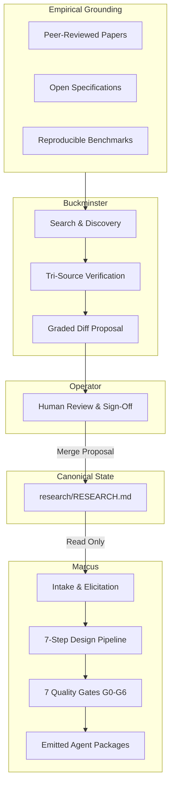
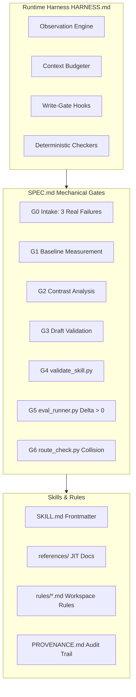

# Demiurge Master Documentation

```yaml
version: 1.0.0
audience: developers, architects, operators, autonomous agents
canonical_path: docs/DOCUMENTATION.md
```

## Table of Contents

1. [Introduction & System Philosophy](#1-introduction--system-philosophy)
2. [Top-Level Design (TLD) Architecture](#2-top-level-design-tld-architecture)
3. [Core Documentation Directory](#3-core-documentation-directory)
   - [3.1 Installation Guide Summary](#31-installation-guide-summary)
   - [3.2 Operating Guide Summary](#32-operating-guide-summary)
   - [3.3 Design Manual Summary](#33-design-manual-summary)
   - [3.4 Research Methodology Summary](#34-research-methodology-summary)
   - [3.5 Independent Benchmarking Summary](#35-independent-benchmarking-summary)
4. [Repository Layout](#4-repository-layout)
5. [Low-Level Design (LLD) Architecture](#5-low-level-design-lld-architecture)
   - [5.1 Harness Implementation](#51-harness-implementation)
   - [5.2 Provenance & Audit Trail](#52-provenance--audit-trail)
   - [5.3 Workspace Rules Architecture](#53-workspace-rules-architecture)
   - [5.4 Mechanical Quality Gates (G0–G6)](#54-mechanical-quality-gates-g0g6)
   - [5.5 Lifecycle Hooks & Boundary Interception](#55-lifecycle-hooks--boundary-interception)
   - [5.6 Evaluation Suites & Regression Isolation](#56-evaluation-suites--regression-isolation)
   - [5.7 Agent Skills & Progressive Disclosure](#57-agent-skills--progressive-disclosure)
6. [Verification & Harness Execution](#6-verification--harness-execution)

---

## 1. Introduction & System Philosophy

Demiurge is a dual-agent engineering system designed to research, synthesize, and maintain autonomous agents. The project separates **empirical observation** from **agent synthesis**.

- **Marcus** is named for Marcus Aurelius (who wrote guidance, then adhered to it). Marcus designs and generates agents, emitting installable packages validated against deterministic quality gates.
- **Buckminster** is named for Buckminster Fuller (comprehensive anticipatory design science). Buckminster monitors empirical research, benchmarks, and security vulnerabilities, proposing graded updates to the system knowledge base.

---

## 2. Top-Level Design (TLD) Architecture

The Top-Level Design establishes a closed, verifiable feedback loop with human-in-the-loop sign-off:



### High-Level Information Flow Principles

1. **Strict One-Way Information Flow:** Buckminster produces empirical evidence; Marcus consumes it. Marcus never synthesizes an agent from claims absent from `research/RESEARCH.md`.
2. **Immutable Production Pinning:** Generated agents pin to the specific `derived_from` snapshot of `RESEARCH.md` used during their synthesis. Updating `RESEARCH.md` flags drift; production agents remain immutable until deliberately upgraded.
3. **Deterministic Superiority over Prompts:** Invariants run as deterministic OS processes and scripts (hooks, regex validators, AST scans). Prompt guidelines degrade over long sessions; deterministic gates maintain constant enforcement.

---

## 3. Core Documentation Directory

The Demiurge documentation suite is structured into focused guides addressing specific operator, developer, and architectural needs:

### 3.1 Installation Guide Summary

- **Target File:** [docs/INSTALLATION.md](INSTALLATION.md)
- **Scope:** Complete deployment instructions for Marcus and Buckminster across multiple environments.
- **Platforms Covered:** Claude Code (`~/.claude/skills/`), Google Antigravity (`~/.gemini/antigravity-ide/skills/`), Gemini CLI, OpenAI / Codex, and local IDEs.
- **Key Commands:** Automated synchronization via `scripts/sync-skills.sh`.

### 3.2 Operating Guide Summary

- **Target File:** [docs/OPERATING_GUIDE.md](OPERATING_GUIDE.md)
- **Scope:** Operational procedures, interactive workflows, concrete prompt examples, and execution gotchas.
- **Key Concepts:**
  - When and how to activate Buckminster vs. Marcus.
  - Prompt templates for claim verification and scheduled research sweeps.
  - Detailed breakdown of 7 operational gotchas: prompt-cache thrashing, lethal trifecta, multi-agent worktree locks, and negative parallelism bans.
  - Architectural best practices including small-N starter evals and fresh-context review patterns.

### 3.3 Design Manual Summary

- **Target File:** [docs/AGENT_DESIGN.md](AGENT_DESIGN.md)
- **Scope:** The human-facing conceptual manual paired with `skills/marcus/AGENT_ARCHITECTURE.md`.
- **Key Concepts:**
  - Structural decomposition of an agent into 4 layers: Identity, Knowledge, Capability, and Verification.
  - Decision flowcharts for session splits, write gating, and evaluation suites.
  - Target projection trade-offs (Agent Skills vs. AGENTS.md vs. Web chat).

### 3.4 Research Methodology Summary

- **Target File:** [skills/buckminster/references/RESEARCH_METHODOLOGY.md](../skills/buckminster/references/RESEARCH_METHODOLOGY.md)
- **Scope:** Scientific and research discipline governing all entries in `research/RESEARCH.md`.
- **Key Protocols:**
  - Tri-Source Verification (Rule K-6): Minimum of 3 independent, hyperlinked sources per claim.
  - Hierarchy of Evidence: Peer-reviewed literature > Open specifications > Vendor reports (vendor capped at 1 of 3).
  - Confidence Grading Taxonomy (`[SETTLED]`, `[CONTESTED]`, `[VENDOR]`, `[EMERGING]`).

### 3.5 Independent Benchmarking Summary

- **Target File:** [docs/BENCHMARKS.md](BENCHMARKS.md)
- **Latest Benchmark Report:** [docs/reports/swebench_v020_summary.md](reports/swebench_v020_summary.md)
- **Scope:** Independent industry benchmarking (SWE-bench, GAIA, Tau-bench) comparing Demiurge against bare foundation models.
- **Key Concepts:**
  - Two-arm evaluation: Arm A (Bare Foundation Model) vs Arm B (Demiurge Architecture).
  - Telemetry formulas: Resolution Lift ($\Delta$), Prompt-Cache Hit Ratio, Cost per Resolved Task, Turn Economy.
  - Latest Run Metrics (`v0.2.0`): $+40.00\%$ resolution lift ($\Delta$), $82.0\%$ prompt-cache hit ratio, $74\%$ lower cost per resolved task.
  - Multi-benchmark roadmap (SWE-bench, GAIA, Tau-bench, BIPIA, BFCL) and execution cadences.

---

## 4. Repository Layout

The repository is organized to isolate research, skills, tools, and rules:

| Path | Primary Function |
|---|---|
| `.agents/` | Canonical workspace configuration and path-scoped rules (`.agents/rules/`). |
| `assets/` | Project diagrams, visual documentation, and brand media. |
| `docs/` | Human-facing guides: Installation, Operating Guide, Design Manual, and Master Documentation. |
| `evals/` | Deterministic gate regression tests and independent industry benchmark adapters. |
| `research/` | Master empirical knowledge base (`RESEARCH.md`), updated solely through reviewed proposals. |
| `scripts/` | Deterministic verification harnesses, security linters, link checkers, and sync tools. |
| `skills/` | Source code and manifests for [Marcus](../skills/marcus/) and [Buckminster](../skills/buckminster/). |

---

## 5. Low-Level Design (LLD) Architecture

The Low-Level Design defines the concrete interfaces, file contracts, and mechanical enforcement mechanisms within Demiurge.



### 5.1 Harness Implementation

The harness represents the runtime environment governing agent execution. Configured in `skills/marcus/HARNESS.md`, it implements the six canonical runtime responsibilities:

1. **Observation:** Mediates environment state disclosure to prevent information overload.
2. **Context:** Enforces prompt-cache optimization by placing static rules at the cache prefix and isolating volatile task state.
3. **Control:** Intercepts execution via deterministic lifecycle hooks.
4. **Action:** Enforces write confirmation gates and sandboxed execution boundaries.
5. **State:** Maintains append-only memory structures (`lessons.md`), preventing brevity collapse.
6. **Verification:** Integrates automated test harnesses including [scripts/check_links.py](../scripts/check_links.py), [scripts/scan_superfluous.py](../scripts/scan_superfluous.py), and syntax gates ([scripts/gate_tropes.py](../scripts/gate_tropes.py), [scripts/gate-tropes.sh](../scripts/gate-tropes.sh), `.vale/styles/Foundry/NegativeParallelism.yml`). Vale uses Go RE2 without lookaround or backreferences, concatenating `raw` list entries sequentially; all alternative patterns therefore reside in a single unified regex to prevent silent dropouts.

### 5.2 Provenance & Audit Trail

Every emitted artifact maintains complete historical traceability:

- **`PROVENANCE.md`:** Records the origin, upstream commits, evaluation benchmarks, and suppression justifications for every skill.
- **Snapshot Binding:** All generated agent headers declare their `derived_from` commit and snapshot date.
- **Suppression Audit:** Security scanner suppressions require explicit reasons recorded in `.forgeignore` or inline comments; unreasoned suppressions cause build failure.

### 5.3 Workspace Rules Architecture

Workspace context files in `.agents/rules/` adhere to Section 10 Primitive standards:

- **Universal Frontmatter:** Requires YAML frontmatter declaring `description`, `globs`, and activation scopes.
- **Cache Optimization:** Rules remain static to maximize prompt-cache hits across turns. Volatile task data is strictly barred from rule files.
- **Platform Mapping:** Maintained canonically in `.agents/rules/` and projected to target platforms (Antigravity, Claude Code, Cursor, Codex).

### 5.4 Mechanical Quality Gates (G0–G6)

Enforced in `skills/marcus/references/SPEC.md` and executed via deterministic scripts:

- **Gate G0 (Intake):** Requires $\ge 3$ documented failure traces. Rejects ungrounded proposals.
- **Gate G1 (Baseline):** Executes untreated baseline task runs before skill synthesis.
- **Gate G2 (Contrast):** Isolates capability differentiators by contrasting successful and failed trajectories on identical tasks.
- **Gate G3 (Draft):** Verifies the draft directly targets the identified capability delta.
- **Gate G4 (Validation):** Executes `validate_skill.py` checking line-level security, AST patterns, path styling, and progressive disclosure limits.
- **Gate G5 (Proof):** Executes `eval_runner.py`. Demands $\Delta > 0$ on capability cases and 100% pass on regression cases.
- **Gate G6 (Registration):** Executes `route_check.py` to ensure description embeddings do not collide with existing library entries.

### 5.5 Lifecycle Hooks & Boundary Interception

Hooks provide deterministic boundary defense independent of model state:

- **`PreToolUse`:** Intercepts mutating tool calls before execution (exit code `2` blocks execution). Non-optional for write operations.
- **`PostToolUse`:** Emits telemetry and logs tool outputs.
- **`Stop`:** Evaluates completion conditions at the conclusion of an agent turn.
- **`UserPromptSubmit`:** Sanitizes input prompts prior to model context ingestion.
- **Contract:** Standardized JSON over `stdin` with exit code evaluation.

### 5.6 Evaluation Suites & Regression Isolation

Located in `evals/evals.json` across skill directories:

- **Dual-Suite Design:**
  - **Regression Suite:** Pinned historical failures that must pass at 100%. Any regression causes immediate rejection.
  - **Capability Suite:** Aspirational tasks measuring advancement from baseline.
- **Deterministic Evaluation:** Automated test runners execute deterministic tests locally without probabilistic judge variance.

### 5.7 Agent Skills & Progressive Disclosure

Emitted skills follow the three-tier Agent Skills standard:

1. **Tier 1: Discovery (Name & Description):** Only metadata is ingested during initial routing. Description must declare specific triggering situations.
2. **Tier 2: Activation (`SKILL.md`):** Instructions loaded upon intent match. Limited to core operational rules under 500 lines.
3. **Tier 3: Execution (`references/`, `scripts/`):** Context-heavy documentation and scripts executed on demand via explicit triggers.

---

## 6. Verification & Harness Execution

Deterministic verification ensures all architectural constraints, security standards, and documentation references remain intact.

### Running Local Validation

Execute the full suite of mechanical gates:

```bash
# 1. Validate Marcus format, line-level security, and progressive disclosure (Gate G4)
python skills/marcus/scripts/validate_skill.py skills/marcus

# 2. Validate Buckminster format and security (Gate G4)
python skills/marcus/scripts/validate_skill.py skills/buckminster

# 3. Execute deterministic gate regression tests
python skills/marcus/evals/run_gate_tests.py

# 4. Verify all internal and external markdown references
python scripts/check_links.py --strict

# 5. Scan repository and skills for superfluous commentary and session transcripts
python scripts/scan_superfluous.py

# 6. Execute SWE-bench evaluation harness in dry-run mode
python evals/benchmarks/swebench/run_swebench_eval.py --slice 0:5 --dry-run

# 7. Run full pre-commit security, style, and negative-parallelism checks
python -m pre_commit run --all-files
```
