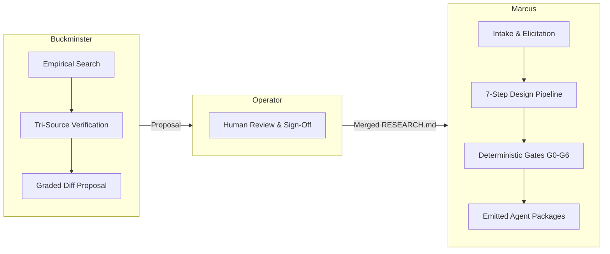

# Demiurge Operating Guide: Marcus & Buckminster

```yaml
version: 1.0.0
audience: developers, operators, autonomous agents
maintained_by: demiurge
canonical_path: docs/OPERATING_GUIDE.md
```

This guide details operating procedures, workflows, concrete examples, gotchas, and best practices for Marcus and Buckminster.

---

## 1. System Philosophy & Division of Labor

Demiurge operates on a strict separation between **empirical research** and **agent synthesis**.



- **Buckminster** gathers empirical evidence, benchmarks, standards, and security findings. Buckminster proposes updates to `research/RESEARCH.md`. Buckminster never writes agent code.
- **Operator** verifies diffs, confirms source links, and signs off on changes to `research/RESEARCH.md`.
- **Marcus** reads `research/RESEARCH.md` exclusively. Marcus drafts, audits, tests, and emits agent packages. Marcus refuses claims absent from `research/RESEARCH.md`.

---

## 2. Buckminster: Research & Evidence Harness

Buckminster maintains the empirical ground truth of the system.

### When to Activate Buckminster

- Checking the validity of an agentic engineering claim or benchmark.
- Researching new agent standards (MCP, AAIF Agent Skills, Agent Plugins, A2A).
- Investigating runtime failure modes, context economics, or security vulnerabilities.
- Executing the scheduled research sweep routine (`agentic-research-sweep`).

### The Tri-Source Verification Standard (Rule K-6)

Every fact, finding, or recommendation proposed by Buckminster must be confirmed by **at least 3 independent, hyperlinked sources**:

1. **Source Hierarchy:** High-reputation peer-reviewed literature > Formal open specifications > Vendor research.
2. **Vendor Limitation:** Vendor-origin sources (e.g., OpenAI, Anthropic, Cognition) may comprise at most **1 of the 3** required citations.
3. **Hyperlink Requirement:** Every citation must include the artifact title and a direct clickable URL or DOI.

### Confidence Grading Taxonomy

Buckminster assigns every finding one of four mandatory markers:

| Marker | Definition | Operational Rule for Marcus |
|---|---|---|
| `[SETTLED]` | Replicated across independent empirical benchmarks or adopted standards. | Encode as default architecture and behavior. |
| `[CONTESTED]` | Conflicting empirical findings, or a single isolated study. | Surface as a user choice; document the conflict. |
| `[VENDOR]` | Originates from an entity selling the product or service. | Exclude from defaults; cite commercial conflict. |
| `[EMERGING]` | Sound theoretical mechanism; lacks longitudinal production data. | Record in design notes; keep out of primary gates. |

### Buckminster Example Workflows

#### Example 1: Verifying a Technical Claim

**Prompt:**

```text
/buckminster
Verify whether storing conversation state in vector stores improves long-horizon
agent task completion compared to plain markdown files.
Cross-reference empirical benchmarks and return a graded finding.
```

**Execution Behavior:**

1. Searches empirical databases (`scite`, `Consensus`, arXiv).
2. Filters out commercial sales collateral.
3. Evaluates replication status (e.g., finding that vector memory degrades long-horizon tasks across models).
4. Generates a markdown diff with explicit citations and confidence tags.

#### Example 2: Scheduled Research Sweep Proposal

**Prompt:**

```text
/buckminster /goal
Execute the scheduled research routine. Inspect recent developments in:
1. Agent Skills execution security and prompt injection.
2. Context window degradation and prompt cache optimization.
3. Multi-agent state management.
Output a formal diff proposal against research/RESEARCH.md.
```

---

## 3. Marcus: Agent Generation & Quality Gates

Marcus designs, validates, and emits production-ready agent skills, subagents, and harness configurations.

### When to Activate Marcus

- Designing a new skill or custom agent from scratch.
- Scaffolding an agent for Claude Code, Antigravity, Gemini, or Codex.
- Auditing an existing skill directory against security and formatting standards.
- Running deterministic gate checks and regressions.

### The 7-Step Design Pipeline

1. **ELICIT:** Extract triggering situations, write boundaries, and past real-world failures.
2. **CLASSIFY:** Determine trifecta posture, write surface, topology, and knowledge tiers.
3. **DERIVE:** Map requirements directly to rules established in `RESEARCH.md`.
4. **DRAFT:** Construct `SKILL.md`, references, evals, and scripts.
5. **EMIT:** Project the canonical specification into target platform templates.
6. **VERIFY:** Execute deterministic scripts (`validate_skill.py`, `eval_runner.py`, `route_check.py`).
7. **HAND OFF:** Deliver installable artifacts, exact paths, and declared assumptions.

### The Seven Enforcement Gates (G0–G6)

Marcus enforces mechanical gates defined in `references/SPEC.md`:

- **G0 (Intake Gate):** Requires at least 3 real failure traces to justify building a skill. Refuses ungrounded claims.
- **G1 (Baseline Gate):** Measures untreated performance without the skill. Zero-shot baseline is required.
- **G2 (Contrast Gate):** Extracts candidates by contrasting failure traces against successful runs on identical tasks.
- **G3 (Draft Gate):** Rejects drafts lacking measured capability gaps or valid citations.
- **G4 (Format & Security Gate):** Deterministic AST, regex, and file structure scan. Zero unreasoned findings.
- **G5 (Proof Gate):** Hard requirement for a positive measured delta ($\Delta > 0$) on capability and 100% pass on regression.
- **G6 (Route Collision Gate):** Checks embedding and description distance against the installed skill library to prevent ambiguity.

### Marcus Example Workflows

#### Example 1: Creating a New Agent Skill

**Prompt:**

```text
/marcus
Design an agent skill for managing PostgreSQL schema migrations safely.
Real failures encountered:
1. Running DDL without transactional wrapping.
2. Dropping active columns before deprecating application references.
3. Acquiring exclusive table locks during peak production traffic.
Target platforms: Antigravity and Claude Code.
```

**Marcus Output:**

- Generates `SKILL.md` with explicit activation situations.
- Implements progressive disclosure (`references/safety_checklist.md`).
- Emits Starter Eval Suite with regression cases matching the 3 failures.
- Runs `validate_skill.py` to confirm zero format or safety flaws.

#### Example 2: Self-Auditing Existing Skills

**Prompt:**

```text
/marcus
Run deterministic Gate G4 validation on skills/marcus and skills/buckminster.
Verify route collision against existing skills.
```

---

## 4. Caveats & Gotchas

### Gotcha 1: Ungrounded Research Rejection (Gate G0 / G11)

Submitting a claim with fewer than 3 hyperlinked sources causes immediate mechanical rejection. Proving a concept requires verifiable links to academic literature, official specs, or reproducible benchmarks.

### Gotcha 2: Gate G5 Is a Hard Failure Gate

Marcus does not ship drafts based on subjective impressions. If `eval_runner.py` shows $\Delta \le 0$ or any regression test fails, the artifact is rejected. Marcus leaves rejected drafts in the archive with their scores rather than forcing deployment.

### Gotcha 3: Negative Parallelism Linter Failures

Pre-commit checks execute `scripts/gate_tropes.py` and Vale style linters. Rhetorical tropes such as *"not X, but Y"* or *"it is not X, rather it is Y"* will break pre-commit. Write direct, affirmative statements.

### Gotcha 4: Prompt-Cache Thrashing

Placing volatile state (timestamps, changing todos, dynamic session logs) inside rule files or top-level system prompts invalidates model prefix caches. This increases execution latency and cost by up to 40x. Keep rule files static and cacheable; isolate volatile state to terminal task context or append-only scratchpads.

### Gotcha 5: The Lethal Trifecta (Rule C-1, C-2)

An agent possessing **Private Data Access** + **Untrusted Input Ingestion** + **External Exfiltration Capability** is vulnerable to prompt injection (>85% attack success). Whenever all three converge, Marcus mandates a multi-session split. Untrusted data is processed in an isolated sub-session; only structured, sanitised summaries pass to the exfiltration boundary.

### Gotcha 6: Multi-Agent Git Worktree Corruption

Allowing concurrent subagents to create or remove git worktrees causes `.git/config.lock` contention and risks catastrophic deletion of the primary `.git` directory. Multi-agent topologies must enforce single-threaded writes and orchestrator-supervised worktree lifecycles.

### Gotcha 7: Version Pinning Immutability

When `RESEARCH.md` receives an update, Marcus notifies the operator of schema drift. Marcus never automatically overwrites existing production agents. Production agents remain pinned to the `derived_from` version recorded in their headers until explicitly upgraded.

---

## 5. Architectural Best Practices

1. **Activate on Situations:** Formulate `description` fields in terms of user-facing trigger situations (*"Use when X occurs and Y is required"*), never abstract capabilities (*"Manages Y"*).
2. **Progressive Disclosure:** Limit `SKILL.md` to core operational rules under 500 lines. Store detailed tables, edge cases, and background evidence in `references/`.
3. **Append-Only Knowledge:** Write accumulated knowledge files (`lessons.md`) in append-only format. Wholesale rewriting causes brevity collapse and loss of operational detail.
4. **Starter Evals (20–50 Cases):** Ground early evaluation in 20–50 real historical failures. High effect sizes occur early in iteration.
5. **Fresh-Context Review:** Pair complex generation tasks with a dedicated reviewer running in an independent context window to eliminate author blind spots.
