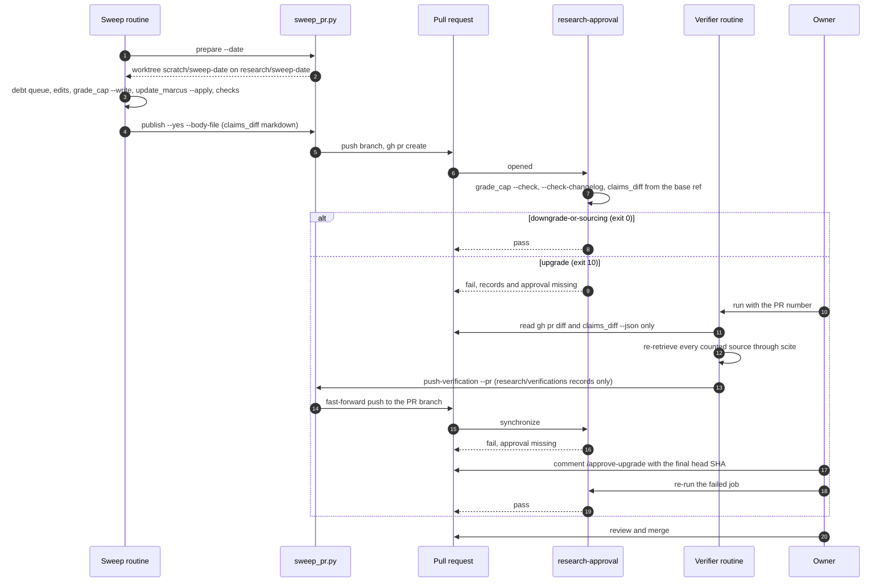

# Research Pipeline: Sweep, Verify, Approve, Merge

```yaml
version: 1.0.0
audience: operators, Buckminster, maintainers
canonical_path: docs/RESEARCH_PIPELINE.md
```

Every change to `research/RESEARCH.md` and `research/sources.yaml` reaches `main` through a pull request. The scheduled Buckminster sweep opens it, CI shows the grade diff and checks the mechanics, a separate verifier run re-retrieves the sources behind any upgrade, and the owner approves and merges. The claim data model is in [CLAIMS_LEDGER.md](CLAIMS_LEDGER.md).

---

## 1. What the Pipeline Guarantees

- **The human merge is the control.** Every research pull request, upgrade or downgrade, waits for the owner to merge it.
- **CI makes the change visible and checks it.** The `research-approval` check shows the grade diff and checks the mechanics. An upgrade also needs a separate fresh-context re-retrieval of its sources and an owner approval bound to the head SHA.
- **Under the bot identity option** (section 5), an approval comment posted by the routine cannot pass the check.
- **Under the owner-credential option**, the routine can forge the approval. The check is then advisory, and the deny rules in section 6 are defense in depth only.
- **A pull request can rewrite its own workflow file.** Sweep branches may touch only `research/**`, `skills/marcus/references/**` and the `derived_from` pin line of `skills/marcus/AGENT_ARCHITECTURE.md`. `sweep_pr.py` refuses any other path locally, and CI runs the same check from the base ref on every `research/*` branch. `claims_diff.py` classifies a change under `scripts/research/`, `.github/` or to `requirements-dev.txt` as an upgrade. The owner reviews any pull request that touches `.github/**`.
- **Verification records attest a fresh-context re-retrieval.** They do not prove who ran the verifier.

---

## 2. Flow



The prompts are `routines/research-sweep.md` and `routines/research-verifier.md`. Both run from the checkout at `$DEMIURGE_REPO`, each in its own worktree under `scratch/`.

---

## 3. The `research-approval` Check

`.github/workflows/research-pr.yml` runs on every pull request, with no `paths` filter, so it can be a required check.

1. **Scope.** A diff that touches nothing under `research/`, `skills/marcus/references/` or `skills/marcus/AGENT_ARCHITECTURE.md` passes at once.
2. **Gate from the base ref.** The job checks the base branch out into a `gate/` worktree, installs `gate/requirements-dev.txt` and runs the scripts from there, so a pull request can weaken neither the scripts that judge it nor the packages they import.
3. **Branch scope.** On a `research/*` branch, `sweep_pr.py check-scope` fails any path outside `research/**` and `skills/marcus/references/**`, and any line of `AGENT_ARCHITECTURE.md` other than the `derived_from` pin.
4. **Mechanics.** `grade_cap.py --check` and `--check-changelog` must pass.
5. **Class.** `claims_diff.py` exits 0 for `downgrade-or-sourcing` and 10 for `upgrade`. An upgrade is a raised asserted or effective grade, a new claim at `[CONTESTED]` or higher, a removed claim, `meta.enforced` turning false, or a change under `scripts/research/`, `.github/` or to `requirements-dev.txt`.
6. **Upgrade gate.** `check_verifications.py` needs a passing record for every upgraded or new claim, and `check_upgrade_approval.py` needs the owner's approval of the head SHA.

A base branch without `scripts/research/claims_diff.py` passes as a bootstrap run. That only applies to the pull request that introduces this pipeline.

Every `research/RESEARCH.md` or `sources.yaml` edit changes the `snapshot_sha256` that `AGENT_ARCHITECTURE.md` pins, and the `checks` job fails until the pin matches. The sweep runs `update_marcus.py --apply`, which copies the snapshot to Marcus's references and rewrites only that pin line. It edits no rule. When a downgrade drops a claim below the grade a rule cites, `check_rule_citations.py` fails and the sweep stops; the rule change is the owner's.

### 3.1 Verification Records

The verifier writes one record per claim at `research/verifications/<claim-id>/<claim_sha256[:12]>.yaml`. The path is keyed on the claim's content, because pushing the record changes the head SHA. A record passes when:

- its `claim_sha256` matches `skills/marcus/references/claims.json`
- its `verdict` is `pass`
- its `verifier` differs from its `proposer`
- it carries a `verifier_session_sha256`, never a raw session id
- every source `grade_cap` counts has `url_resolves`, `quote_found`, `reception.checked` and `independence_group_confirmed` set true

---

## 4. Approving an Upgrade

`check_upgrade_approval.py` reads the pull request's issue comments through `gh api` and passes only on a comment where:

- `user.login` is the approver and `user.type` is `User`. The approver is the `RESEARCH_APPROVER_LOGIN` repository variable, or the repository owner when a user owns the repository. An organization-owned repository without the variable fails the check with an error.
- `user.login` differs from the `RESEARCH_BOT_LOGIN` repository variable. An approver equal to it is a configuration error. When it is unset, the job prints a warning that the check is advisory.
- the comment was never edited: `created_at` equals `updated_at`. Anyone with write access can edit another user's comment, so an edited approval does not count.
- one line reads `/approve-upgrade <sha>`, with the full 40-character head SHA

A new push changes the head SHA and voids every earlier approval. The order is:

1. The verifier pushes its records.
2. The owner reads the diff and the records, then comments `/approve-upgrade <final head SHA>`.
3. The owner re-runs the failed job, with `gh run rerun <run-id> --failed` or from the Actions page.
4. The owner merges.

Downgrade and sourcing pull requests pass the check automatically and still need the owner's merge.

---

## 5. Identity Options

The approval check can only tell accounts apart. How much it proves depends on which account the routines push with.

| Option | Setup | What the approval check proves |
|---|---|---|
| **(a) Bot identity (recommended)** | The sweep and the verifier push through a bot, either the Claude GitHub App or a machine user, with contents and pull request write access only. Set the `RESEARCH_BOT_LOGIN` repository variable to its login, and `RESEARCH_APPROVER_LOGIN` to the owner's login when an organization owns the repository. | A comment from the routine fails the check, because the bot is not the owner and its login is denied. Only the owner's own account can approve. |
| **(b) Owner credentials** | The routines use the owner's local `gh` login. | Nothing about identity. The routine can post `/approve-upgrade` as the owner, so the check is advisory. The owner's review before merge and the deny rules are what remain. |

Under either option, a ruleset on `main` is the control against a direct push: require a pull request, require the `checks`, `pre-commit` and `research-approval` checks, block force-push and deletion, and leave the bypass list empty. Setting up the ruleset, the bot and the variable is an operator step.

---

## 6. Deny Rules (Defense in Depth)

The routines' own Claude Code settings can deny the commands the hard rules already forbid. Put these in the routine's settings only, never in a committed `.claude/settings.json`:

```json
{
  "permissions": {
    "deny": [
      "Bash(git push:*)",
      "Bash(gh pr merge:*)",
      "Bash(gh pr comment:*)",
      "Bash(gh pr review:*)",
      "Bash(gh pr edit:*)",
      "Bash(gh label:*)",
      "Bash(gh issue comment:*)",
      "Bash(gh api:*)"
    ]
  }
}
```

- **The sweep pushes only through `sweep_pr.py publish`.** Its push runs inside the script, so a `git push` rule on the agent's shell commands leaves it working.
- **The verifier pushes only through `sweep_pr.py push-verification`.** Its settings keep the `Bash(git push:*)` entry too.
- **Prefix rules are easy to step around.** `git -C <dir> push` and a script that calls `git` both miss a prefix match. Treat these rules as a second layer under the ruleset and the bot identity, never as the control.

---

## 7. Related Files

| Path | Role |
|---|---|
| `routines/research-sweep.md` | Scheduled sweep prompt: debt queue, edits, checks, `sweep_pr.py publish`. |
| `routines/research-verifier.md` | Fresh-context verifier prompt: re-retrieval and verification records. |
| `scripts/research/sweep_pr.py` | `prepare` creates the sweep worktree and branch; `publish` is the sweep's only push path, `push-verification` the verifier's; `check-scope` is the scope guard CI runs. |
| `scripts/research/claims_diff.py` | Classifies a diff as `upgrade` or `downgrade-or-sourcing` and writes the pull request report. |
| `scripts/research/check_verifications.py` | Checks the verification records for every upgraded or new claim. |
| `scripts/research/check_upgrade_approval.py` | Checks for the owner's `/approve-upgrade` comment on the head SHA. |
| `.github/workflows/research-pr.yml` | Runs the `research-approval` check. |
